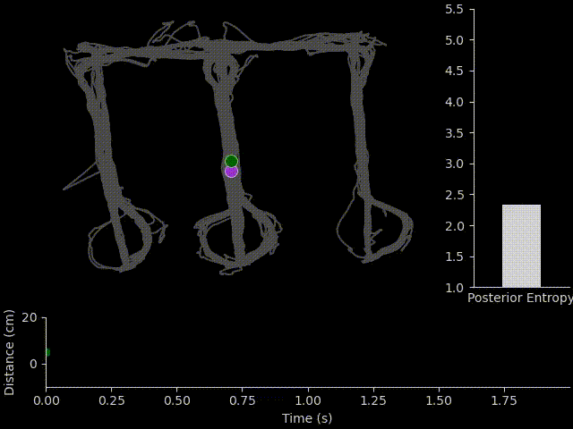

# ms_stim_analysis

Analysis package and notebooks released in conjunction with the paper
**Disruption of theta-timescale spiking impairs learning but leaves hippocampal
replay intact** (unpublished).

Results demonstrate effects of theta-phase specific optogenetic inhibition of medial
septum PV neurons on hippocampal LFP, neuron coordination, and susequent task learning.

**Demo:**
Phase-specific stimulation of medial septum suppresses sweeps of hippocampal-represented
location during track traversal.



## Installation

To install the package with custom analysis tables and run the associated notebooks first clone the repo to your local system.
Then navigate to the cloned directory and run:

```pip install .```

**Todo**:

- pypi release

## Usage

### New work

Those wanting to use the analysis pipelines on new datasets are welcome to install the package and use the custom tables in conjunction with their existing database and `spyglass` ecosystem.

### Reuse and Replication

All raw data and derived results (e.g. spikesorting, LFP) are available through [this Dandi archive](TODO) *(upcoming)*.

Additionally, we plan to release a docker image containing pre-built a conda environment,
the notebooks from this repository, and a populated SQL database containing all information needed to query and retrieve the results of this work from the Dandi archive. **(build in progress)**
